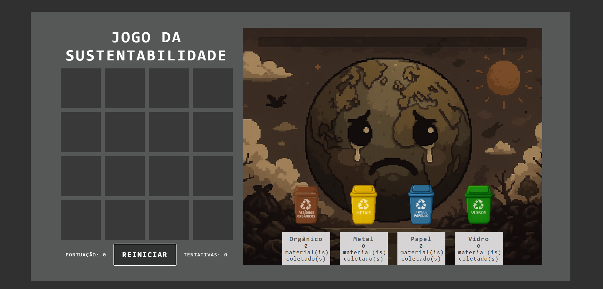

# ♻️ Jogo da Sustentabilidade

Um jogo da memória educativo feito em React, onde os jogadores combinam pares de materiais recicláveis. A cada acerto, uma barra de progresso ambiental avança e a imagem do planeta melhora. Ideal para promover a conscientização ecológica de forma divertida.

## 📸 Demonstração



---

## 🚀 Tecnologias usadas

- [React](https://reactjs.org/)
- CSS Puro

---

## 🧠 Funcionalidades

- Combinação de pares de materiais recicláveis
- Progresso visual com imagem do planeta conforme a pontuação
- Contador de tentativas e pontuação
- Contadores por tipo de resíduo (vidro, papel, metal, orgânico)
- Reinício do jogo a qualquer momento

---

## 🙌 Contribuição

Contribuições são bem-vindas! Para sugerir melhorias, envie um pull request ou abra uma issue.

---

## 📦 Instalação

Clone o repositório e execute:

```bash
npm install
npm start

